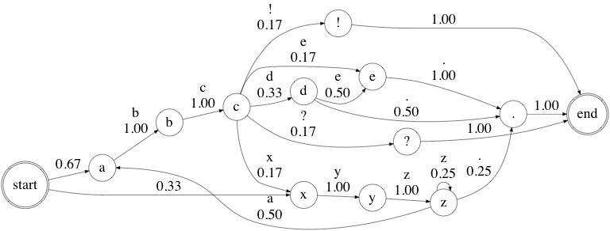
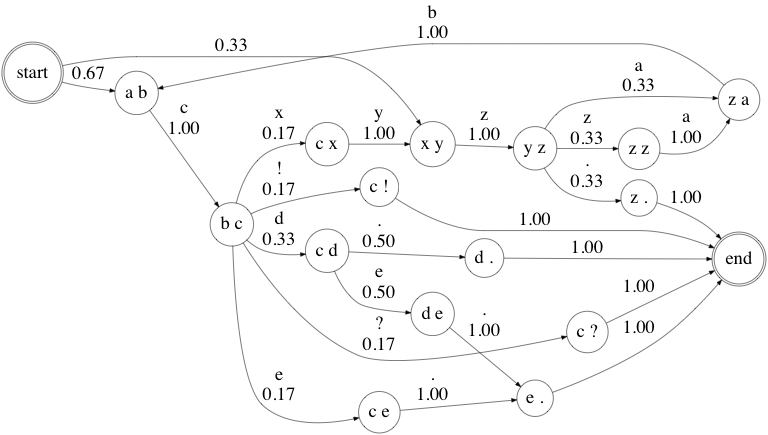

Project 0: Markov Babbler
-----------------------------

 Andrey Markov (Андре́й Ма́рков, 1856-1922), for whom [Markov Chains](https://en.wikipedia.org/wiki/Markov_chain) and Markov Processes are named.

Version 1.000

* * *

### Table of Contents

*   [Introduction](#Introduction)
*   [Code](#Code)
*   [Books](#Books)

TODO: Put the data for download into Google Drive (books.zip)
Questions to answer about the books (number of states, line stoppers, why that is happening)

### Introduction

Our goal is to write a program that generates random sentences that kind of sound like an author or authors that we trained our program on. For example, we may want to train our program on Lewis Carroll's _Alice in Wonderland_, and then generate sentences that kind of sound like Lewis Carroll. How should we do this?

One very simple approach (and the approach we will us here) is a [Markov Chain](https://en.wikipedia.org/wiki/Markov_chain). A Markov Chain is a state diagram that has probabilities attached to each transition between states.

Here are two good online articles about this:

* [Building Markov Chains in golang](https://mb-14.github.io/tech/2018/10/24/gomarkov.html)
* [Using Markov Chains to generate Lifetime Movie titles](https://www.soliantconsulting.com/blog/title-generator-using-markov-chains/)

I've written some very simple test cases that don't even use complete words, just letters.

    a b c d .
    a b c e .
    a b c d e .
    a b c x y z .
    x y z a b c !
    x y z z a b c ?

If we convert this to a unigram model, we get the following state diagram:

If we look at bigrams, we get:

### Code

Your code should go in [`babbler.py`](babbler.py).

There are unit test cases for the file [`tests/test1.txt`](tests/test1.txt) in [`test_markov.py`](test_markov.py).

Once your basic implementation of the methods in [`babbler.py`](babbler.py) is working, you should pass these test cases.

### Books

Download [this zipfile](https://drive.google.com/open?id=1YN238uggXVqec7-rR-qkGNunvPP5QkvO) of longer texts. Unzip the zipfile into your markov folder.

Train your babbler on one or more of these texts, and produce some interesting sentences.

Submit your most interesting 5 sentences, along with the code for babbler.py
